# MERN Project

3 folders are created:

- frontend
- backend
- uploads

On the root

```javascript
npx create-react-app frontend
```

Clean the frontend folder, move .gitignore and README files to the root, remove the .git file on frontend folder and create a one in the root folder.

Create a new repo on github and

```javascript
git add .
```

```javascript
git commit -m 'your commit'
```

```javascript
git remote add origin https://github.com/<gituser>/<your-repo>.git
```

In frontend folder, install

```javascript
npm i react-bootstrap bootstrap react-icons
```

Import in the index.js file
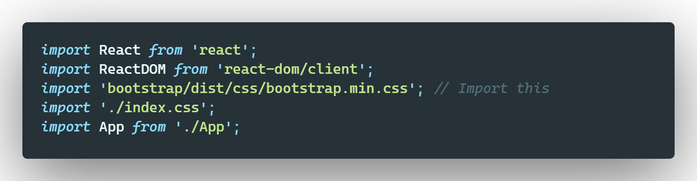

In frontend/src folder, create components folder and create Header.jsx file in it

In App.js file, import
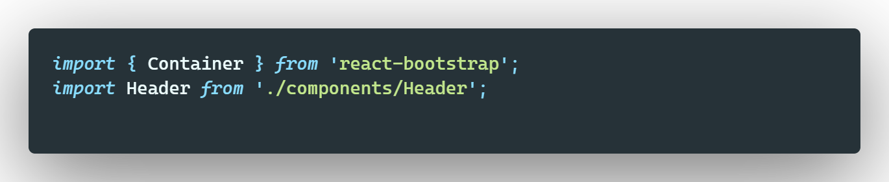

In components folder, create Footer.jsx file in it. Import in the App.js file
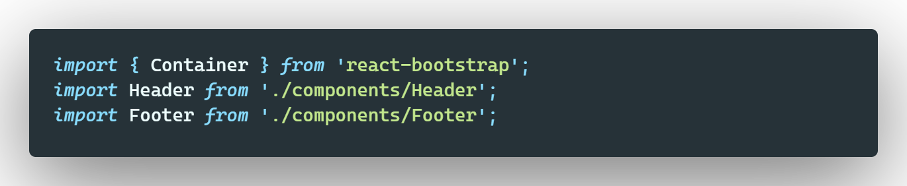

Custom bootstrap with adding assets folder

#### To get a static list of products

- Download the products-and-images folder
- Put an images folder in the public one
- Insert the products.js file in src folder

In the scr folder, create a screens folder with <ins>HomeScreen.js </ins> file

Import HomeScreen.js in App.js file
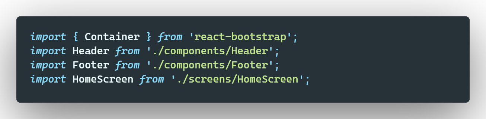

Create Product component => /src/components/Product.jsx & import it in HomeScreen.js
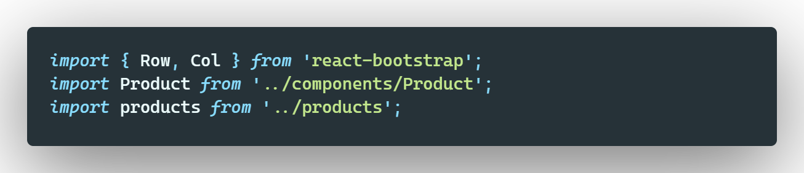

Install React Router Dom

```javascript
npm i react-router-dom
```

To have routes, a lot of changes in index.js file
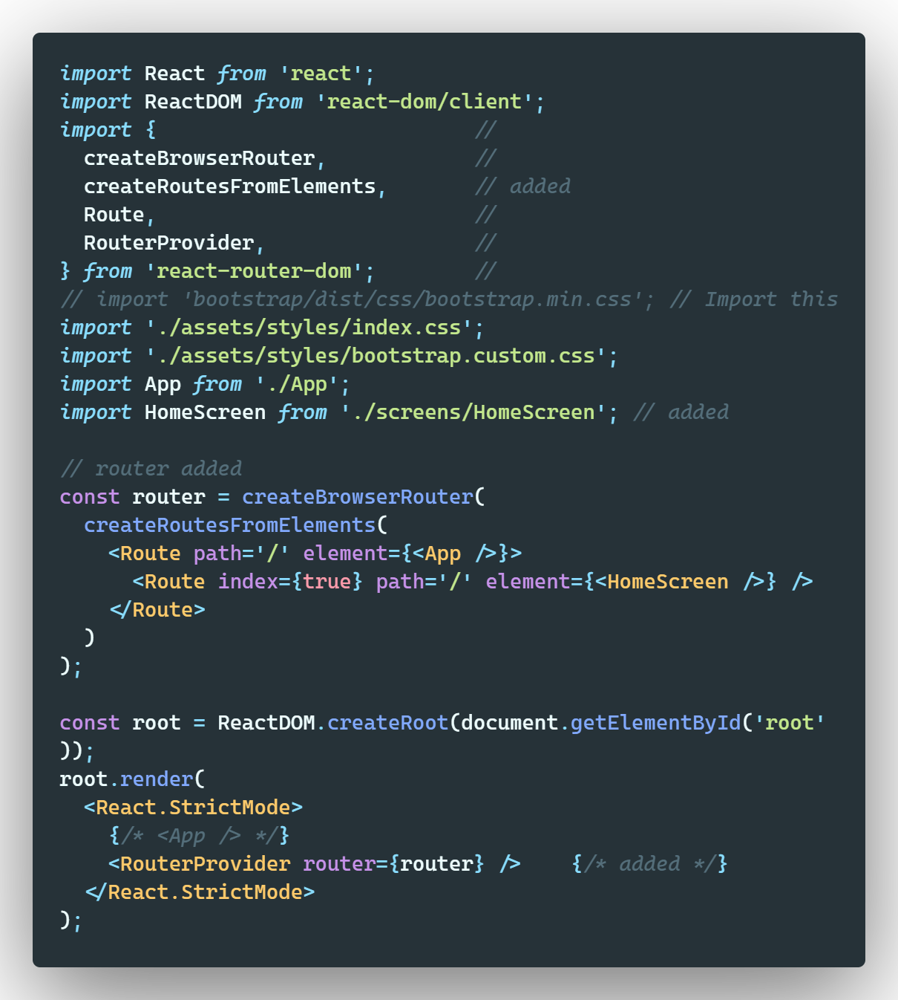

We no longer need to import HomeScreen.js in App.js file, use Outlet from react-router-dom
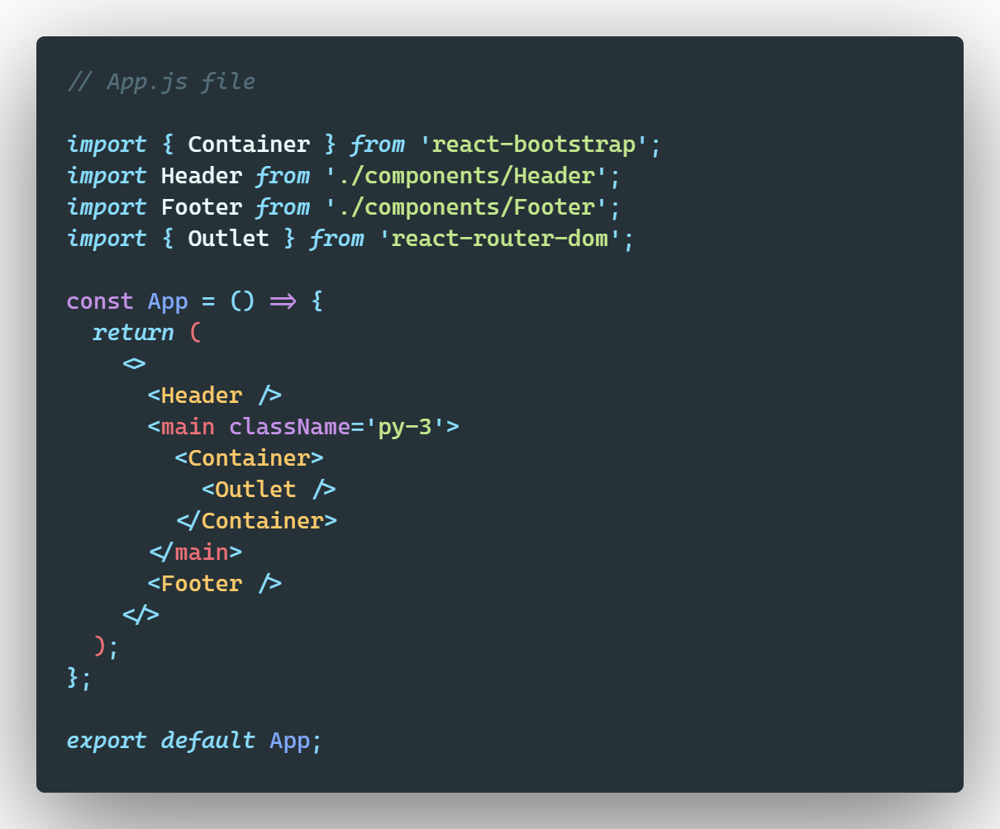

> Use Link in Product.js file, replace <ins>a</ins> tag with Link and change <ins>href</ins> attribute with <ins>to</ins> attribute

Install React Router Bootstrap

```javascript
npm i react-router-bootstrap
```

And use LinkContianer from react-router-bootstrap like this

before
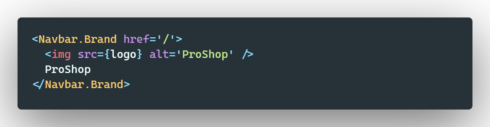
alter
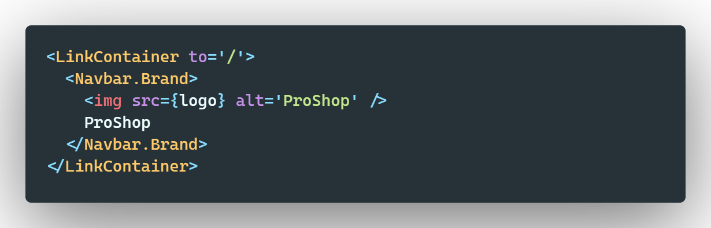

### Rating

Create a Rating component and bring in it into Product component

> If the name of product change we use product-title class (in index.css) to get the same Card height (add className in Card.Title in Product component)

### Product details

- Create ProductScreen.js file
- Create a route in index.js file

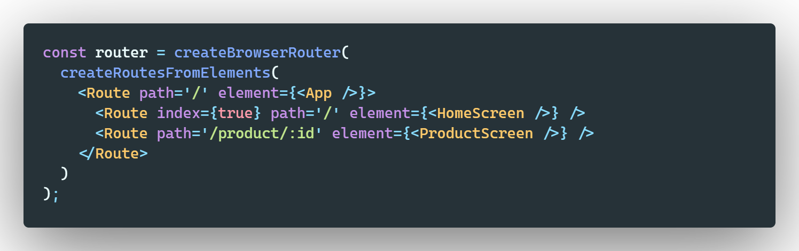

# Create Server Side

In the root

```javascript
npm init
```

Use ES6 modules, in package.json file in the root add type module

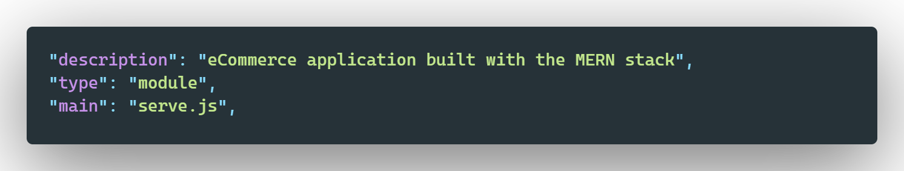

Create server.js file in backend folder

> To run server, in package.json file
> 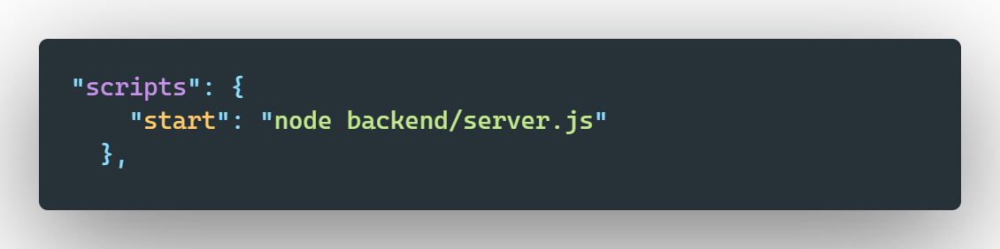

Install express & colors packages and test connection
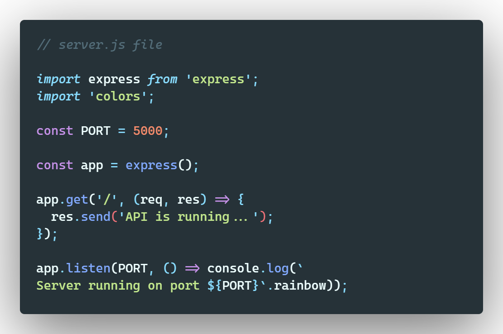

For data, create a data folder in backend and paste in it a copy of products.js file

Install nodemon and concurrently like devdependencies

```javascript
npm i -D nodemon concurrently
```

and in package.json file
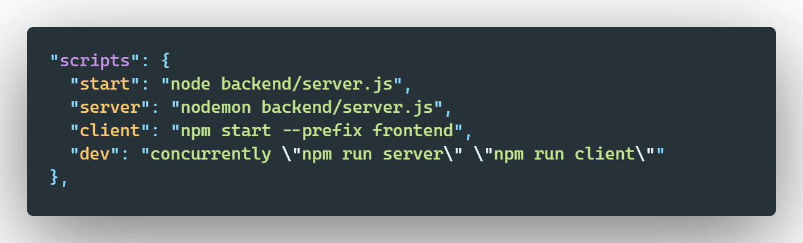

#### Environment variables

Install dotenv as devdependency

```javascript
npm i -D dotenv
```

Add .env file in the root

> Install axios like frontend dependency

In frontend/package.json file add after private line
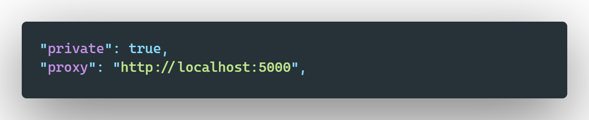

Fetch data from backend, use axios in frontend/screens/HomeScreen.js file, and use useSate and useEffect
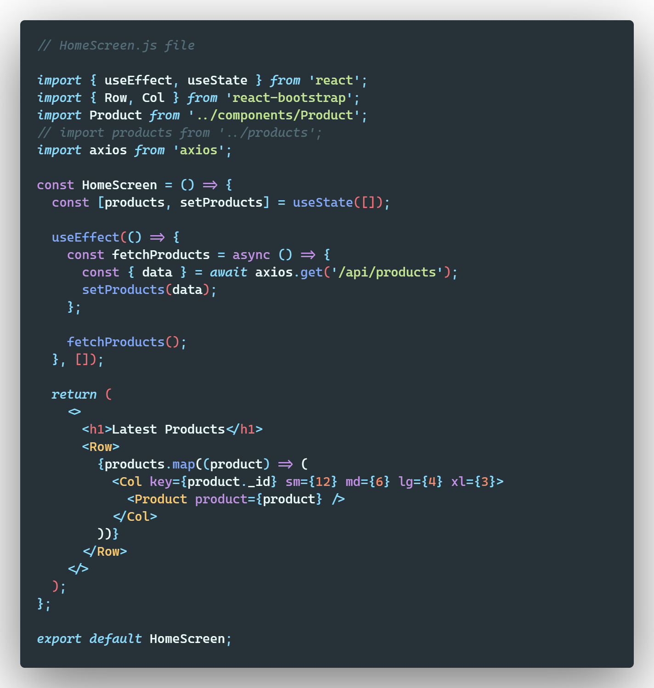

> Do same thing in ProductScreen.js file
